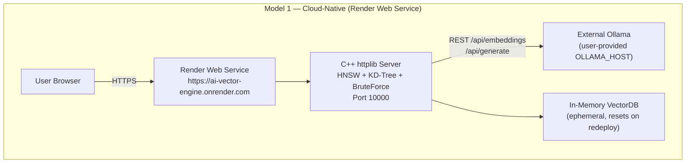
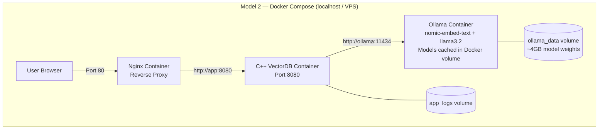
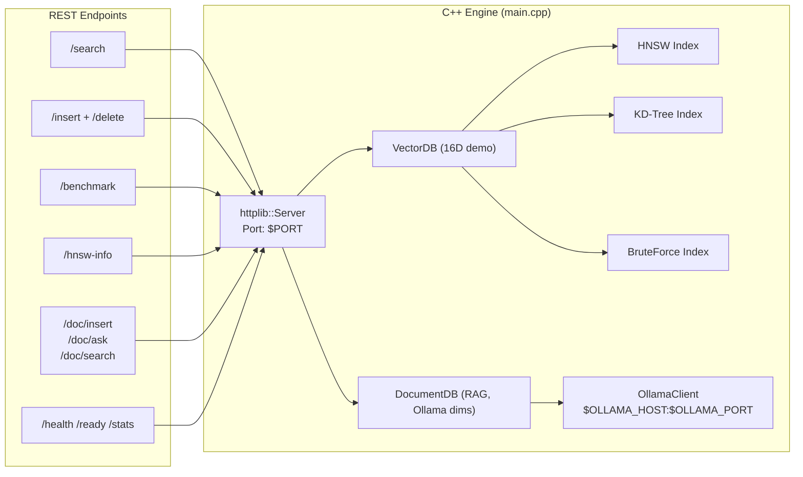
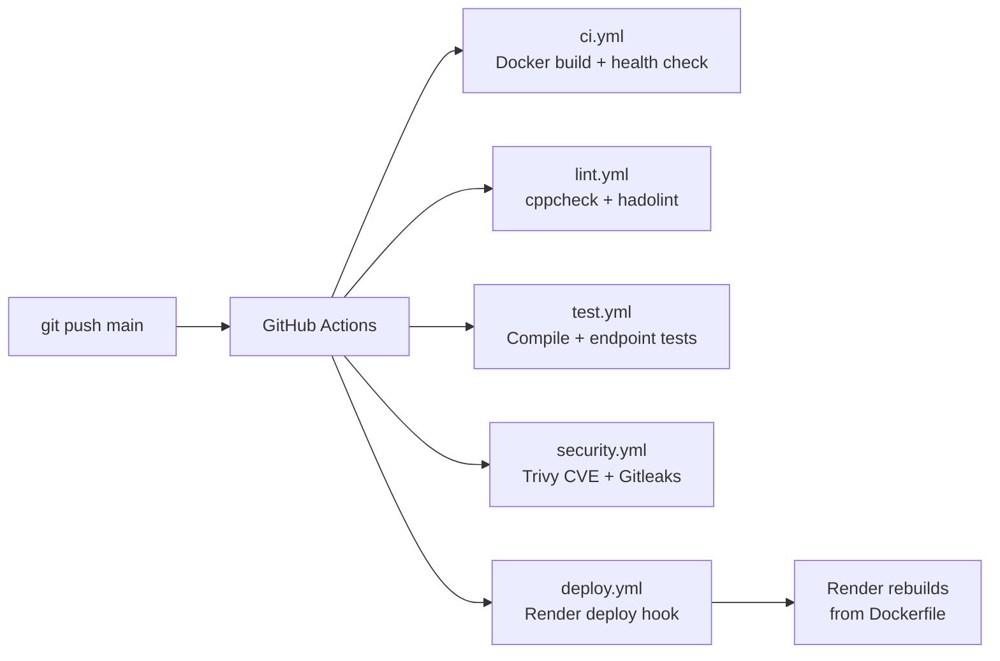

# Architecture — AI-Vector-Engine

## System Overview

The project follows the **Dual Architecture Deployment** pattern. Both models run
from the **same source code** with zero changes to application logic, UI, or features.

---

## Model 1 — Cloud-Native (Live Portfolio Link)



**Platform:** Render Web Service (Docker runtime)
**Build:** Multi-stage Dockerfile (gcc:12 → debian:bookworm-slim)
**Port:** 10000 (set via `PORT` env var — Render requirement)
**CI/CD:** GitHub Actions → Render deploy hook on push to `main`

---

## Model 2 — Self-Hosted Docker Compose (Any Machine)



**Start command:**
```bash
docker-compose -f infra/docker/docker-compose.yml up -d
```

**Production override (resource limits + log rotation):**
```bash
docker-compose \
  -f infra/docker/docker-compose.yml \
  -f infra/docker/docker-compose.prod.yml \
  up -d
```

**Supported Environments & Platforms for Model 2:**
- **Desktop Operating Systems:** Windows 10/11 (Docker Desktop/WSL2), macOS (Intel & Apple Silicon), Linux (Ubuntu, Debian, Fedora, Arch).
- **Cloud VPS / Virtual Machines:** Any Linux server (Oracle Cloud Free Tier, DigitalOcean Droplet, Hetzner, AWS EC2, GCP Compute Engine, Linode).
- **Home Servers / Edge:** Local Homelabs, Raspberry Pi 4/5 (64-bit), Intel NUCs.
- **CI/CD Environments:** GitHub Actions runners, GitLab CI, Jenkins.


---

## Application Internals



---

## Port Reference

| Context | PORT | OLLAMA_HOST |
|---------|------|-------------|
| Localhost (direct) | 7860 (default) or `PORT=8080` | 127.0.0.1 |
| Docker Compose | 8080 | ollama (service name) |
| Render (cloud) | 10000 | user-provided or blank |
| Hugging Face Spaces | 7860 | user-provided |

---

## CI/CD Pipeline


